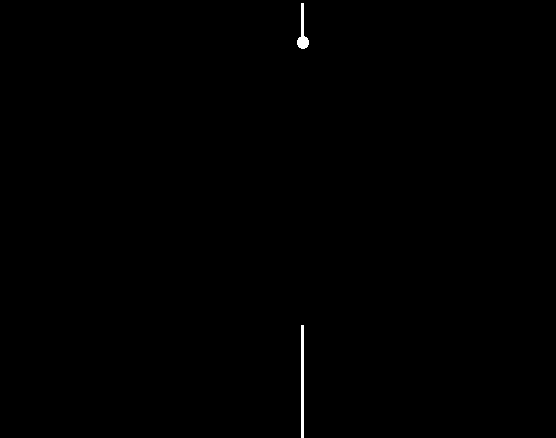
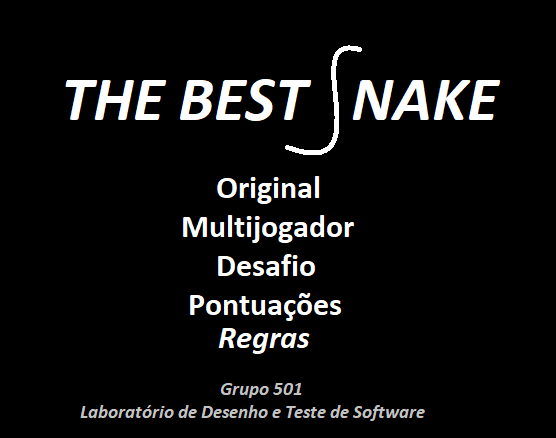
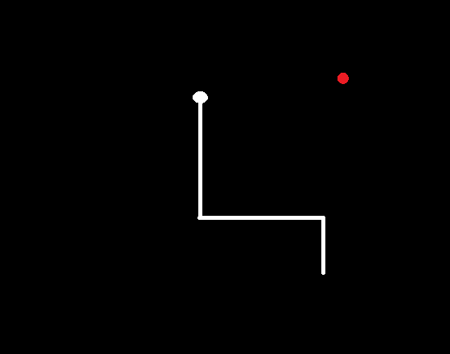
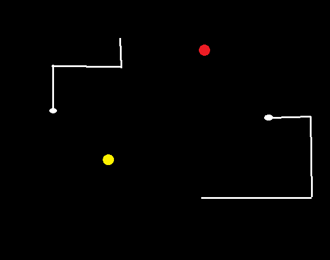
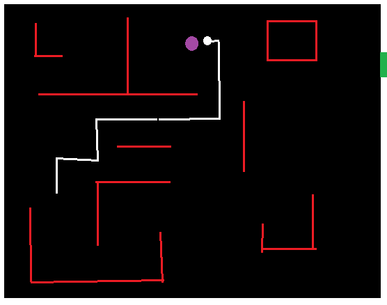

## LDTS_<05><01> - <THE BEST SNAKE>

> Include here one or two paragraphs explaining the main idea of the project, followed by a sentence identifying who the authors are.
Para o nosso projeto escolhemos como base o jogo "Snake". O projeto terá vários modos de jogo , nomeadamente , o modo original , um modo multijogador e um modo desafio. Em todos as cobras têm que apanhar frutas para crescer e cumprir o objetivo de cada minijogo.
Este projeto foi desenvolvido por Duarte Lopes up202006408, Leandro Silva up202008061, Tiago Barbosa up202004926 para LDTS 2021/22.

### IMPLEMENTED FEATURES

> This section should contain a list of implemented features and their descriptions. In the end of the section, include two or three screenshots that illustrate the most important features.

**Examples**:

- **Jumping** - The game character will jump when the space bar key is pressed.
- **Getting hidden coins** - When the game character hits a platform from below (by jumping beneath it) it will smash that segment of the platform and will get any coins that may exist hidden there.

### FUNCIONALIDADES A IMPLEMENTAR

- **Movimentar sozinha** - A cada unidade de tempo a cobra anda na direção em que está a apontar garatindo que está em constante movimento.
- **Movimentar** - Cada cobra irá se mover consoante a tecla pressionada [SETAS OU AWSD].
- **Comer frutas** - Quando a cobra comer uma fruta espalhada pelo ecrã o seu tamanho irá alterar consoante as propriedades dessa fruta.
- **Sair das bordas** - No modo original e multijogador quando a cobra sai pela borda ela regressa do lado oposto.

- **Propriedades das frutas** - Cada fruta terá uma propriedade que modificará o comportamento da cobra que terão vantagens e desvantagens dependendo do modo de jogo. Cada fruta poderá aumentar e diminuir o tamanho em diferentes fatores [-1,+1,*2,/2,...] e também poderá mudar a velocidade da cobra.
- **Fruta mistério** - Esta fruta ao contrário das restantes irá ter propriedades aleatórias cada vez que é consumida.
- **Menu** - Menu com opções para jogar cada modo de jogo, ver as regras de cada jogo e ver as pontuações registadas para cada modo de jogo.

- **Modo original** - O objetivo deste modo é crescer a cobra o máximo possível consumindo frutas e não embatendo nela própria.                              

- **Modo multijogador** - Neste modo existe um "combate" entre duas cobras controladas por dois jogadores distintos onde o objetivo é tentar encurralar a outra cobra levando-a a embater no corpo da adversária. Consoante a estratégia de cada jogador todas as frutas terão vantagens e desvantagens. Tal como no modo original se uma cobra colidir com ela própria também perderá o jogo.

- **Modo desafio** - Neste modo mais desafiante existem paredes a circundar a arena e obstáculos dentro da arena dificultando assim as travessias da cobra. O objetivo deste modo de jogo é a cobra chegar a um tamanho predefinido para poder sair pela porta sagrada. Se a cobra colidir com ela própria , com as paredes ou obstáculos ou tentar entrar na porta sagrada sem o tamanho necessário então o jogo terminará em derrota. Neste modo existirão 3 níveis de dificuldades diferentes com arenas distintas e tamanhos finais variados.                                  

- **Regras** - Se no menu for selecionada a opção das regras irá ser mostrado todas as regras gerais e específicas de cada modo de jogo.
- **Pontuações** - Na opção pontuações irá ser mostrado para cada modo de jogo as melhores pontuações de jogos anteriores mostrando no modo original o tamanha máximo alcançado, no modo multijogador o vencedor e a duração da partida e no modo desafio o tempo necessário para concluir cada nível.
- **Salvar jogo** - Permite guardar quais os níveis já concluídos pelo utilizador e todas as pontuações.
- **Carregar jogo** - Permite carregar a partir de um ficheiro o nível atual no modo desafio e todas as pontuações. Se for iniciado um jogo sem carregar um anterior , o modo desafio irá começar pelo nível fácil e as pontuações estarão vazias.

### DESIGN

> This section should be organized in different subsections, each describing a different design problem that you had to solve during the project. Each subsection should be organized in four different parts:

- **Problem in Context.** The description of the design context and the concrete problem that motivated the instantiation of the pattern. Someone else other than the original developer should be able to read and understand all the motivations for the decisions made. When refering to the implementation before the pattern was applied, don’t forget to [link to the relevant lines of code](https://help.github.com/en/articles/creating-a-permanent-link-to-a-code-snippet) in the appropriate version.
- **The Pattern.** Identify the design pattern to be applied, why it was selected and how it is a good fit considering the existing design context and the problem at hand.
- **Implementation.** Show how the pattern roles, operations and associations were mapped to the concrete design classes. Illustrate it with a UML class diagram, and refer to the corresponding source code with links to the relevant lines (these should be [relative links](https://help.github.com/en/articles/about-readmes#relative-links-and-image-paths-in-readme-files). When doing this, always point to the latest version of the code.
- **Consequences.** Benefits and liabilities of the design after the pattern instantiation, eventually comparing these consequences with those of alternative solutions.

**Example of one of such subsections**:

------

#### THE JUMP ACTION OF THE KANGAROOBOY SHOULD BEHAVE DIFFERENTLY DEPENDING ON ITS STATE

**Problem in Context**

There was a lot of scattered conditional logic when deciding how the KangarooBoy should behave when jumping, as the jumps should be different depending on the items that came to his possession during the game (an helix will alow him to fly, driking a potion will allow him to jump double the height, etc.). This is a violation of the **Single Responsability Principle**. We could concentrate all the conditional logic in the same method to circumscribe the issue to that one method but the **Single Responsability Principle** would still be violated.

**The Pattern**

We have applied the **State** pattern. This pattern allows you to represent different states with different subclasses. We can switch to a different state of the application by switching to another implementation (i.e., another subclass). This pattern allowed to address the identified problems because […].

**Implementation**

The following figure shows how the pattern’s roles were mapped to the application classes.

These classes can be found in the following files:

- [Character](https://web.fe.up.pt/~arestivo/page/courses/2021/lpoo/template/src/main/java/Character.java)
- [JumpAbilityState](https://web.fe.up.pt/~arestivo/page/courses/2021/lpoo/template/src/main/java/JumpAbilityState.java)
- [DoubleJumpState](https://web.fe.up.pt/~arestivo/page/courses/2021/lpoo/template/src/main/java/DoubleJumpState.java)
- [HelicopterState](https://web.fe.up.pt/~arestivo/page/courses/2021/lpoo/template/src/main/java/HelicopterState.java)
- [IncreasedGravityState](https://web.fe.up.pt/~arestivo/page/courses/2021/lpoo/template/src/main/java/IncreasedGravityState.java)

**Consequences**

The use of the State Pattern in the current design allows the following benefits:

- The several states that represent the character’s hability to jump become explicit in the code, instead of relying on a series of flags.
- We don’t need to have a long set of conditional if or switch statements associated with the various states; instead, polimorphism is used to activate the right behavior.
- There are now more classes and instances to manage, but still in a reasonable number.

#### KNOWN CODE SMELLS AND REFACTORING SUGGESTIONS

> This section should describe 3 to 5 different code smells that you have identified in your current implementation, and suggest ways in which the code could be refactored to eliminate them. Each smell and refactoring suggestions should be described in its own subsection.

**Example of such a subsection**:

------

#### DATA CLASS

The `PlatformSegment` class is a **Data Class**, as it contains only fields, and no behavior. This is problematic because […].

A way to improve the code would be to move the `isPlatformSegmentSolid()` method to the `PlatformSegment` class, as this logic is purely concerned with the `PlatformSegment` class.

### TESTING

- Screenshot of coverage report.
- Link to mutation testing report.

### SELF-EVALUATION

> In this section describe how the work regarding the project was divided between the students. In the event that members of the group do not agree on a work distribution, the group should send an email to the teacher explaining the disagreement.

**Example**:

- John Doe: 40%
- Jane Doe: 60%