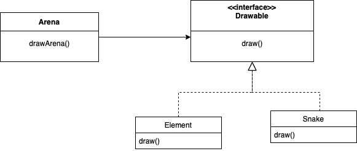
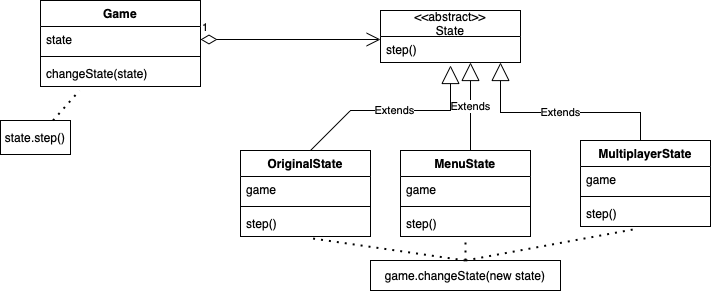
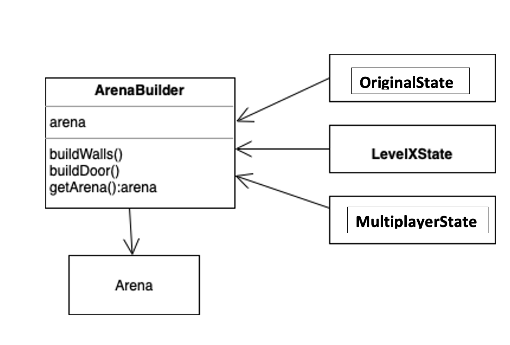
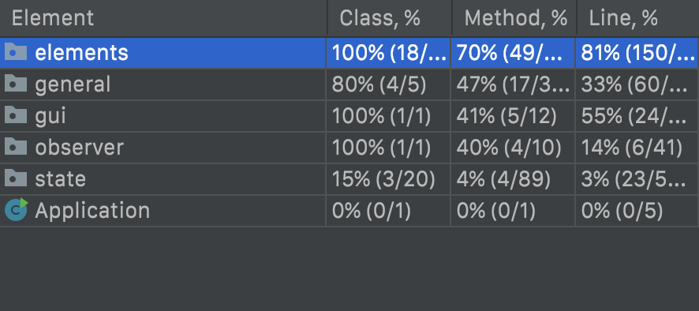

# LDTS <05 01> - THE BEST SNAKE

Para o nosso projeto escolhemos como base o jogo "snake". O projeto terá vários modos de jogo, nomeadamente, o modo original , um modo multijogador e um modo desafio. Em todos as cobras têm que apanhar frutas para crescer e cumprir o objetivo de cada minijogo.
Este projeto foi desenvolvido por Duarte Lopes up202006408, Leandro Silva up202008061, Tiago Barbosa up202004926 para LDTS 2021/22. Pode ver uma descrição mais detalhada [aqui](../README.md).

## FUNCIONALIDADES IMPLEMENTADAS

- **Movimentar sozinha** - A cada unidade de tempo a cobra anda na direção em que está a apontar garatindo que está em constante movimento.
- **Movimentar** - Cada cobra irá se mover consoante a tecla pressionada [SETAS OU AWSD].
- **Sair das bordas** - No modo original e multijogador quando a cobra sai pela borda ela regressa do lado oposto.
- **Comer frutas** - Quando a cobra comer uma fruta espalhada pelo ecrã o seu tamanho irá alterar consoante as propriedades dessa fruta.
- **Propriedades das frutas** - Cada fruta terá uma propriedade que modificará o comportamento da cobra que terão vantagens e desvantagens dependendo do modo de jogo. Cada fruta poderá aumentar e diminuir o tamanho em diferentes fatores e também poderá mudar a velocidade da cobra.
- **Fruta mistério** - Esta fruta ao contrário das restantes irá ter propriedades aleatórias cada vez que é consumida.
- **Pause** - Permitir ao utilizador pausar o jogo atual.
- **Menu** - Menu com opções para jogar cada modo de jogo, ver as regras de cada jogo e ver as pontuações registadas para cada modo de jogo.
- **Modo original** - O objetivo deste modo é crescer a cobra o máximo possível consumindo frutas e não embatendo nela própria.
- **Modo multijogador** - Neste modo existe um "combate" entre duas cobras controladas por dois jogadores distintos onde o objetivo é tentar encurralar a outra cobra levando-a a embater no corpo da adversária. Consoante a estratégia de cada jogador todas as frutas terão vantagens e desvantagens. Tal como no modo original se uma cobra colidir com ela própria também perderá o jogo.
- **Modo desafio** - Neste modo mais desafiante existem paredes a circundar a arena e obstáculos dentro da arena dificultando assim as travessias da cobra. O objetivo deste modo de jogo é a cobra chegar a um tamanho predefinido para poder sair pela porta sagrada. Se a cobra colidir com ela própria , com as paredes ou obstáculos ou tentar entrar na porta sagrada sem o tamanho necessário então o jogo terminará em derrota. Neste modo existirão 3 níveis de dificuldades diferentes com arenas distintas e tamanhos finais variados.
- **Regras** - Se no menu for selecionada a opção das regras irá ser mostrado todas as regras gerais e específicas de cada modo de jogo.
- **Pontuações** - Na opção pontuações irá ser mostrado para cada modo de jogo as melhores pontuações de jogos anteriores mostrando no modo original o tamanha máximo alcançado, no modo multijogador o vencedor e a duração da partida e no modo desafio o tempo necessário para concluir cada nível.
- **Reset** - Permite resetar as pontuações.
## FUNCIONALIDADES A IMPLEMENTAR

Todas as funcionalidades desejadas foram implementadas.

## DESIGN

### Diferentes formas de desenhar os elementos

#### Contexto do problema

O nosso jogo está sempre a atualizar o seu estado e para isso precisamos sempre de mostrar no ecrã os vários elementos em jogo.No entanto cada elemento como as cobras, as frutas, as paredes, etc têm formas diferentes e propriedades diferentes. Assim precisávamos de uma forma para desenhar todo o nosso programa sem ter que usar um if-else statement enorme.

#### Pattern

O pattern que nós escolhemos foi o **_Command Pattern_** já que vai permitir mostrar no ecrã todos os elementos usando a mesma função.

#### Implementação

Este pattern evita o uso de várias flags para determinar o tipo de elemento que pretendemos desenhar porque ele remete essa tarefa para o próprio objeto permitindo assim apenas mandar o objeto desenhar-se a si próprio.
Assim podermos apenas percorrer todo os elementos em jogo e fazê-los desenharem-se a eles mesmos.

As classes podem ser encontradas aqui:
- [Arena](../src/main/java/pt/up/ldts/general/Arena.java)
- [Drawable](../src/main/java/pt/up/ldts/elements/Drawable.java)
- [Element](../src/main/java/pt/up/ldts/elements/Element.java)
- [Snake](../src/main/java/pt/up/ldts/elements/Snake.java)

#### Consequências

O uso deste pattern traz vantagens como:
- Permite que a classe que chama a função não tenha que saber como fazer algo remetendo essa tarefa para cada objeto
- Permite fazer undo/redo
- Facilita a implementação de novos objetos não sendo necessário alterar o objeto que chama a função dos outros.

### Os vários estados do nosso jogo

#### Contexto do problema

O nosso jogo tem vários estados em que se pode encontrar num certo momento comecando pelo menu. Dependendo desse estado a forma como o programa evolui varia e por isso precivámos de uma forma de não ter que andar a verificar qual o estado atual e só depois agir em conformidade.

#### Pattern

Decidimos aplicar o **_State Pattern_** para o nosso programa visto que permite controlar os vários estados possíveis da mesma forma.
#### Implementação

Nesta implementação o programa tem a si associado um estado que tem um tarefa principal(step()) que está sempre a ser executada no loop do jogo.
Depois cada estado, dependendo do que acontecer, pode mudar o estado do jogo permitindo assim controlar sempre em que estado está o programa.

As classes podem ser encontradas aqui:
- [Game](../src/main/java/pt/up/ldts/general/Game.java)
- [State](../src/main/java/pt/up/ldts/state/State.java)
- [OriginalState](../src/main/java/pt/up/ldts/state/OriginalState.java)
- [MultiplayerState](../src/main/java/pt/up/ldts/state/MultiplayerState.java)
- [MenuState](../src/main/java/pt/up/ldts/state/MenuState.java)
#### Consequências

O uso deste pattern traz vantagens como:
- Torna desnecessário o uso de várias flags para controlar o estado do programa
- Facilita a integração de um novo estado no programa não sendo necessário mudanças no código

Este pattern trouxe uma desvantagem já que tivemos que criar uma nova classe para cada estado novo ficando assim o programa com muitas classes.
### Construir uma arena com diferentes propriedades

#### Contexto do problema

Dependendo de qual minijogo vamos jogar a nossa arena tem atributos diferentes como por exemplo ter uma ou duas cobras, ter ou não obstáculos e ter ou não uma porta como por exemplo no modo desafio. Assim precisávamos de uma forma de construir uma arena sem ser necessário o uso de flags ou de um construtor com parâmetros null.

#### Pattern

Decidimos aplicar o **_Builder Pattern_** para o nosso programa já que permitia ter um objeto que se preocupava com a construção da nossa arena e dos vários pormenores de cada minijogo.
#### Implementação

Criámos uma classe ArenaBuilder que criava uma arena geral e depois tinha várias funções como adicionar paredes e adicionar porta que permitia a cada minijogo do nosso programa criar a arena da forma que necessitar
, usando essas funções disponíveis.

As classes podem ser encontradas aqui:
- [Arena](../src/main/java/pt/up/ldts/general/Game.java)
- [ArenaBuilder](../src/main/java/pt/up/ldts/state/State.java)
- [OriginalState](../src/main/java/pt/up/ldts/state/OriginalState.java)
- [MultiplayerState](../src/main/java/pt/up/ldts/state/MultiplayerState.java)
- [LevelXState](../src/main/java/pt/up/ldts/state/LevelXState.java)
#### Consequências

O uso deste pattern traz vantagens como:
- Permite-nos construir a arena de forma progressiva passo a passo ao invés de ter vários construtores ou usar recursão.
- Permite-nos isolar a parte de construção da arena para um objeto próprio permitindo assim que cada estado que use uma arena não tenha que saber como ela se cria e apenas tenha que solicitar a sua criação. 

## CODE SMELLS

#### Método longo
O método com este code smell é o saveScore() em [EndOriginal](../src/main/java/pt/up/ldts/state/EndOriginalState.java) que tem muitas linhas e pode ficar bastante complicado de ler e para o resolver deveríamos usar o **Extract Method** onde criávamos funções mais pequenas para realizar algumas tarefas.
#### Classe longa
As classes [Arena](../src/main/java/pt/up/ldts/general/Arena.java) e [Snake](../src/main/java/pt/up/ldts/elements/Snake.java) são classes muito extensas o que pode dificultar a sua leitura.Podemos usar o método **Extract Class** para criar subclasses , no entanto estas duas classes são muito importantes no nosso programa e tendo em conta os design patterns usados, é natural que estas classes sejam longas.
#### Código duplicado
Nas classes [EndMultiplayerState](../src/main/java/pt/up/ldts/state/EndMultiplayerState.java) e [EndOriginalState](../src/main/java/pt/up/ldts/state/EndOriginalState.java) o método saveScore() é muito semelhante pelo que devíamos usar o método **Pull Up Field** e passar este método para a classe [State](../src/main/java/pt/up/ldts/state/State.java).

## TESTES

Coverage dos testes:

-[Mutation](../build/reports/pitest/202201281512/index.html)

## AUTOAVALIAÇÃO

Todos os membros do grupo trabalharam de forma equivalente e deram o seu melhor para este projeto
- Duarte Lopes : 33.3%
- Leandro Silva : 33.3%
- Tiago Barbosa : 33.4%